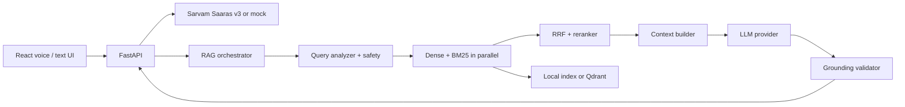

# VAANI AI — Hacker House Goa 2026 Task 2

VAANI AI is a voice-enabled, multilingual Retrieval-Augmented Generation (RAG) system built for Indic-language knowledge retrieval: **Knowledge, heard. Answers, grounded.** It accepts typed or spoken questions, transcribes audio with Sarvam Saaras v3 in production, retrieves from a metadata-aware hybrid index, validates grounding, and returns concise answers with evidence and stage-by-stage latency.

The repository runs out of the box in **demo mode**: a bundled, deterministic local index, mock STT, and context-only mock generator make the API, UI, tests, and benchmark usable without credentials. The VAANI voice panel uses a browser-native microphone waveform, displays the authoritative REST transcription only after recording stops, and then calls the existing combined voice-to-RAG API. Production data preparation is an offline command; the API never downloads or embeds MSMARCO-XI at startup.

## What is implemented

- Sarvam STT provider (`saaras:v3`, configurable `mode`, timeout and retry) plus credential-free mock STT
- MSMARCO-XI download, inspection, normalization, deterministic IDs, deduplication, chunking, embedding and persisted-index commands
- Fixed-token, sentence, sliding-window, semantic, metadata-aware, and parent-child chunkers
- Local exact cosine store and Qdrant REST adapter behind a `VectorStore` interface
- Multilingual hash demo embeddings and an optional `intfloat/multilingual-e5-small` SentenceTransformers path
- Concurrent dense + BM25 retrieval, reciprocal-rank fusion, language filtering and reranking
- Bounded context construction, configurable OpenAI-compatible LLM, deterministic grounding validation, injection/unsafe/low-context guardrails
- Request IDs, JSON logging, rate limiting, bounded concurrent RAG requests, health/readiness, structured errors, LRU cache and latency telemetry
- Responsive React/Vite voice UI with transcript, source and separate STT/RAG latency displays

## Architecture



See [architecture](docs/ARCHITECTURE.md), [retrieval](docs/RETRIEVAL.md), [guardrails](docs/GUARDRAILS.md), and [latency methodology](docs/LATENCY.md) for the engineering decisions.

## Quick start

Prerequisites: Python 3.11+ and Node 20+ for the frontend.

```bash
cd Task_2
python -m venv .venv
# PowerShell: .\.venv\Scripts\Activate.ps1
# macOS/Linux: source .venv/bin/activate
python -m pip install -e ".[dev]"
copy .env.example .env  # PowerShell; use cp on macOS/Linux
python -m uvicorn app.main:app --reload
```

Open API docs at `http://localhost:8000/docs`. In a second terminal:

```bash
cd Task_2/frontend
npm install
npm run dev
```

Set `VITE_API_URL` to the deployed API URL for frontend hosting. It is the only frontend environment variable; do not put API keys in it.

## Demo requests

```bash
curl http://localhost:8000/health
curl http://localhost:8000/ready
curl -X POST http://localhost:8000/api/v1/query -H "Content-Type: application/json" -d '{"query":"What is retrieval augmented generation?"}'
```

`DEMO_MODE=true` uses a known, safe test transcript for an uploaded voice clip. It makes the end-to-end voice UX demonstrable without accidentally claiming that a local mock is speech recognition.

## Build the MSMARCO-XI index

Install optional ML dependencies once, then run the offline pipeline. Set `--config` after running the first command if you want a specific Hugging Face dataset configuration.

```bash
python -m pip install -e ".[ml]"
python -m ingestion.download_dataset --limit 5000
python -m ingestion.inspect_dataset
python -m ingestion.normalize
python -m ingestion.chunk --strategy semantic
python -m ingestion.build_index --strategy semantic --backend sentence_transformer
```

For a fast local artifact instead:

```bash
python -m ingestion.build_index --demo
```

The resulting `data/index/index.json` and its manifest are intentionally ignored by Git. Configure `INDEX_PATH` to load it at startup. More detail: [dataset](docs/DATASET.md) and [chunking](docs/CHUNKING.md).

## Provider configuration

Production STT uses `SARVAM_API_KEY`, `SARVAM_BASE_URL`, `SARVAM_STT_MODEL=saaras:v3`, and `SARVAM_STT_MODE=transcribe`. `transcribe` preserves the speaker's language; use `codemix` only when that output format is intentionally needed. Sarvam REST is intended for short audio; route long recordings through an asynchronous/batch workflow outside this request path.

For generation set `DEMO_MODE=false`, `LLM_PROVIDER=openai_compatible`, `LLM_BASE_URL`, `LLM_API_KEY`, and `LLM_MODEL`. For Qdrant set `VECTOR_STORE=qdrant`, `QDRANT_URL`, `QDRANT_API_KEY`, and `QDRANT_COLLECTION`; retain a local persisted index for BM25 and fallback data.

All environment variables and safe defaults are in [.env.example](.env.example). See [security](docs/SECURITY.md).

## Verification

```bash
python -m pytest
python -m ruff check .
python -m mypy app ingestion evaluation
python -m evaluation.benchmark --queries 100
cd frontend && npm run build
```

The benchmark creates `evaluation_results/latency_results.csv`, JSON, and Markdown from the current runtime. No latency or retrieval-quality number is prefilled in this repository.

## Deployment

- [Docker](docs/deployment/DOCKER.md)
- [Render](docs/deployment/RENDER.md)
- [Frontend hosting](docs/deployment/FRONTEND.md)
- [Free-tier operations](docs/deployment/FREE_TIER.md)

The supplied Render configuration intentionally starts in demo mode and does not download the dataset during a build. Prepare and host an index separately before switching a production service to a non-demo provider configuration.

## Repository layout

```text
Task_2/
├── app/                 # FastAPI API, pipeline, providers, retrieval and guardrails
├── ingestion/           # Explicit offline MSMARCO-XI pipeline
├── evaluation/          # Latency and retrieval-quality benchmark harness
├── frontend/            # React/Vite voice and text interface
├── data/demo/           # Small committed, multilingual demo corpus
├── tests/               # Unit, integration and performance-contract tests
├── docs/                # Architecture, operations, submission and video docs
└── evaluation_results/  # Generated benchmark output (ignored except .gitkeep)
```

## Limits and honest status

The bundled corpus is a small demo subset, not the full MSMARCO-XI dataset. Real Sarvam, LLM, and Qdrant calls need corresponding credentials. The deterministic hash embedder exists only to make development self-contained; use the optional multilingual semantic model for quality evaluation. The benchmark measures the present machine/index/configuration only, and external voice latency is reported separately from RAG latency.

See [implementation status](docs/IMPLEMENTATION_STATUS.md) for validation results from this checkout.
