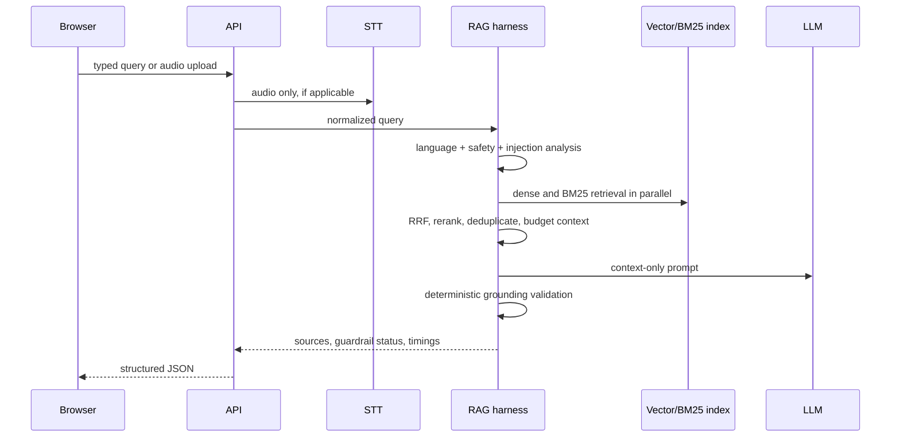

# Architecture

## Request lifecycle

`RAGOrchestrator` owns the pipeline boundary. Provider adapters implement replaceable STT, embedding, LLM, and vector-store capabilities. Startup only loads a persisted local index or the tiny bundled demo corpus; offline ingestion owns download and embedding.

Failure paths are bounded: invalid media gets a 400 response, unsafe/injection queries are withheld before retrieval, weak retrieval never reaches the LLM, and transient Sarvam/LLM failures receive one retry with backoff before a structured service error. The local rate limiter and request semaphore protect a single free-tier instance; neither is distributed.
